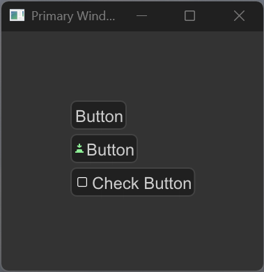
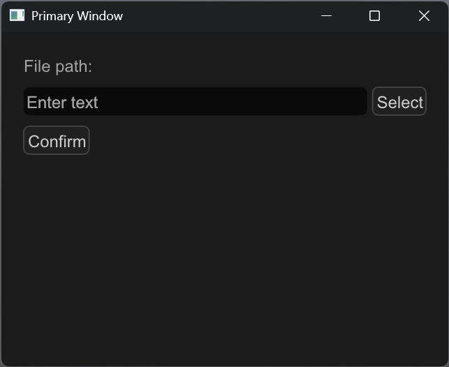
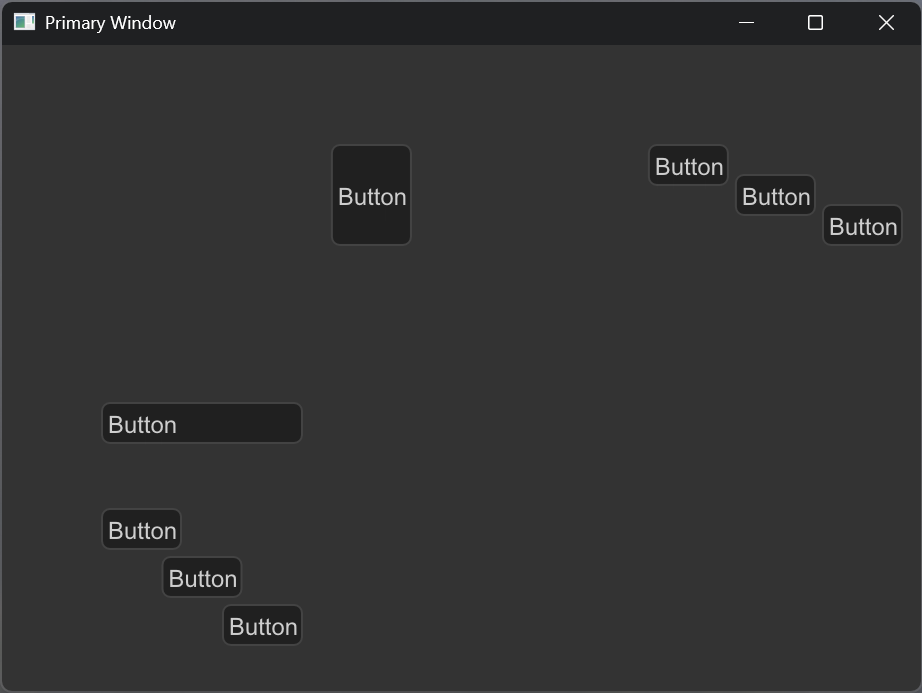
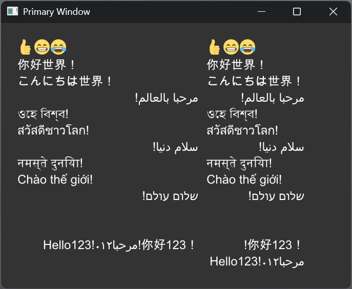

# VecGui

**VecGui** is a high-performance, GPU-accelerated vector GUI framework for C++, heavily inspired by the Godot Engine's UI architecture.


> **Note:** This project is currently under heavy development and APIs are subject to change.

---

## 🚀 Why VecGui?

Most C++ GUI frameworks are either immediate-mode (like ImGui) which can be hard to manage for complex layouts, or bitmap-based which suffer from blurriness on HiDPI screens. **VecGui** offers a middle ground:

- **Godot-like Workflow**: If you've used Godot, you'll feel right at home. It uses a Node-based scene tree, signals (coming soon), and a powerful container-based layout system.
- **Pure Vector Rendering**: Powered by [Pathfinder](https://github.com/servo/pathfinder), every UI element is rendered as a vector shape on the GPU. This means perfect antialiasing and infinite scalability without any loss in quality.
- **Modern C++**: Built with C++17/20, utilizing smart pointers and modern memory management practices.

## ✨ Features

- **🌲 Node-based Scene Management**: Everything is a `Node`. Manage your UI hierarchy intuitively.
- **📐 Advanced Layout Containers**: Includes `HBoxContainer`, `VBoxContainer`, `GridContainer`, and `SplitContainer` with flexible sizing flags (Fill, Shrink, Expand).
- **🎨 High-Quality Rendering**: Support for gradients, complex paths, and subpixel text positioning via Pathfinder.
- **🖥️ Multi-Window & HiDPI**: Native support for multiple windows and arbitrary display scaling.
- **🌐 Internationalization (i18n)**: Built-in `TranslationServer` for localized applications.
- **🤖 Cross-platform**: Works on Windows, Linux, macOS, and Android.

## 📦 Quick Start

Creating a simple UI with a button in a horizontal container:

```cpp
#include "src/app.h"

using namespace vecgui;

class MyScene : public Node {
    void custom_ready() override {
        // 1. Create a container
        auto hbox = std::make_shared<HBoxContainer>();
        hbox->set_separation(10);
        hbox->set_position({100, 100});
        add_child(hbox);

        // 2. Add a button
        auto button = std::make_shared<Button>();
        button->set_text("Click Me!");
        button->container_sizing.flag_h = ContainerSizingFlag::Fill;
        hbox->add_child(button);
    }
};

int main() {
    // Initialize App with 1280x720 window
    App app({1280, 720}, true); 
    
    // Add your scene to the tree
    app.get_tree_root()->add_child(std::make_shared<MyScene>());
    
    // Start the main loop
    app.main_loop();
    
    return 0;
}
```

## 🖼️ Gallery

| Layout System | Text & i18n |
| :---: | :---: |
|  |  |

| Multi-Window Support | Widgets |
| :---: | :---: |
|  |  |

## 🛠️ Building

Revector uses CMake. Ensure you have the necessary Vulkan/OpenGL SDKs installed.

```bash
mkdir build && cd build
cmake ..
cmake --build .
```

## 🗺️ Roadmap
- [ ] Complete Signal/Slot implementation for event handling.
- [ ] Theme and StyleBox resource system.
- [ ] More complex widgets: `Tree`, `TabContainer`, `GraphEdit`.
- [ ] Animation system (Tweens).

---
*Inspired by Godot. Powered by Pathfinder.*
